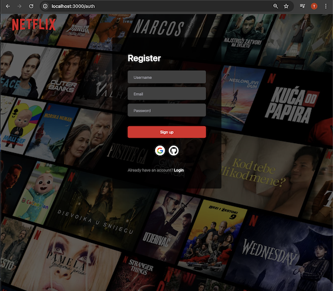
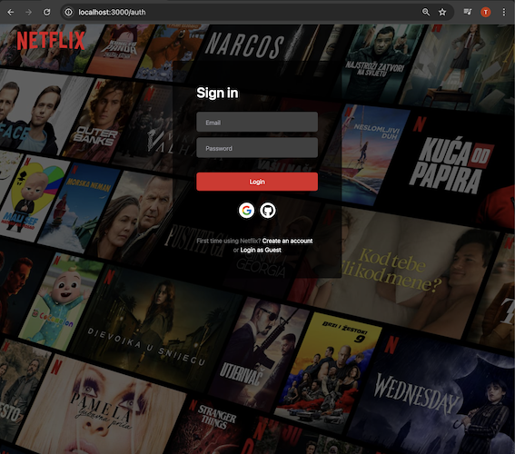
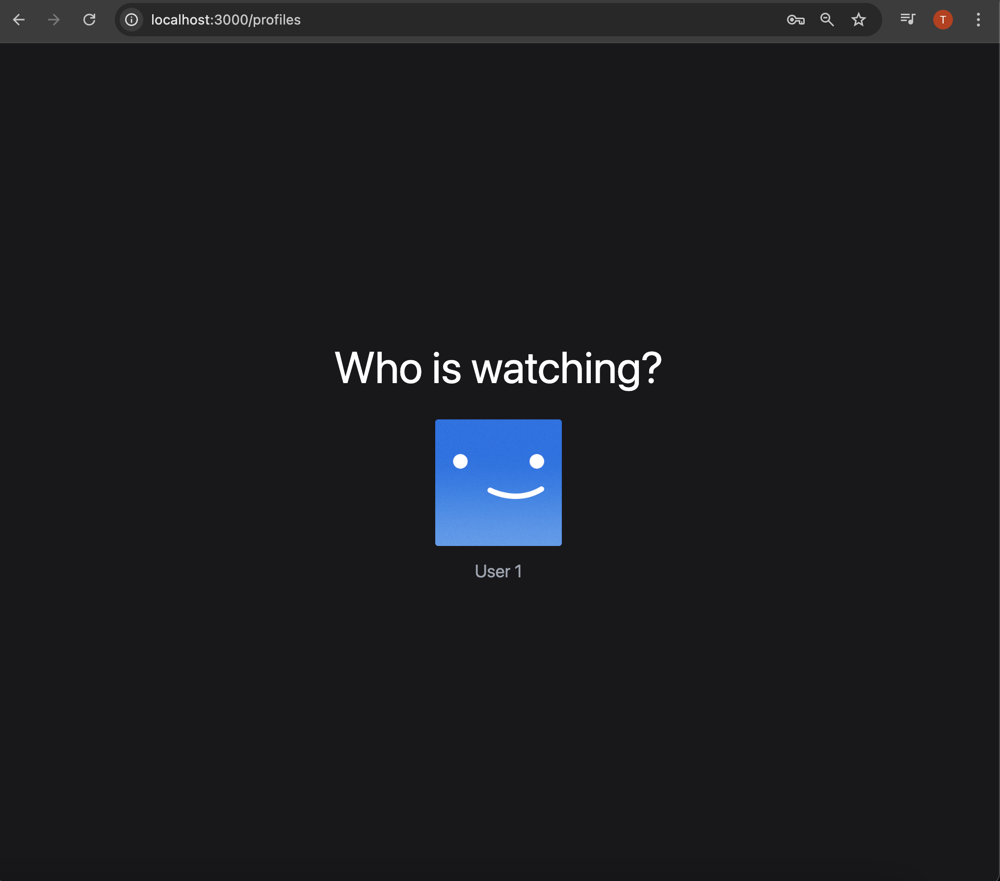
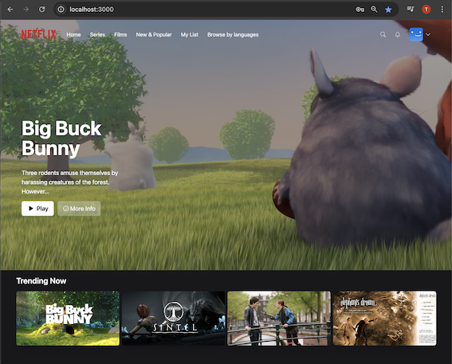
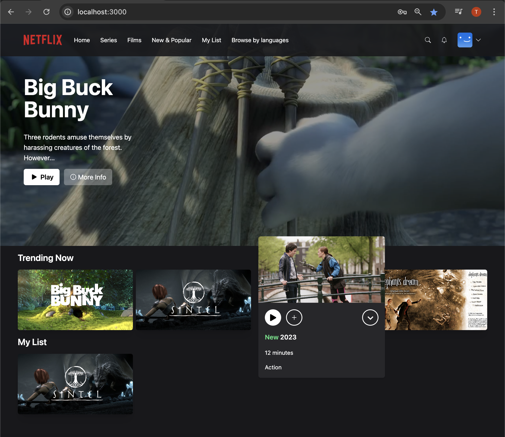
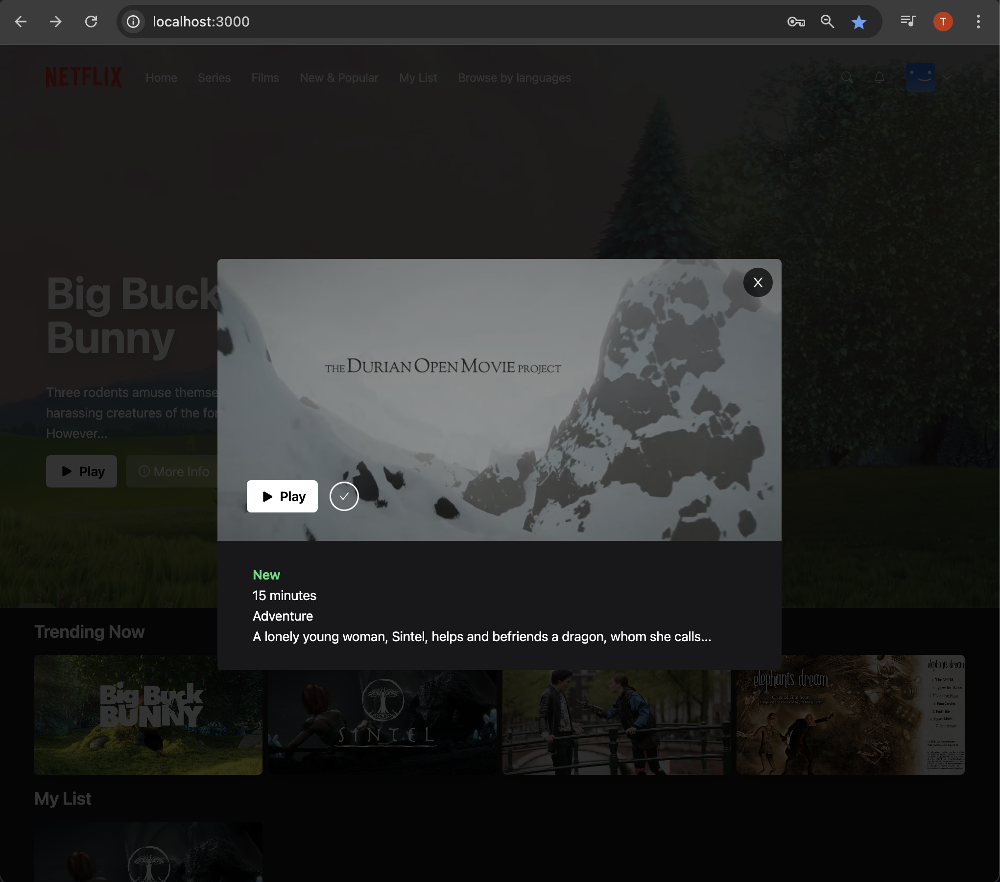
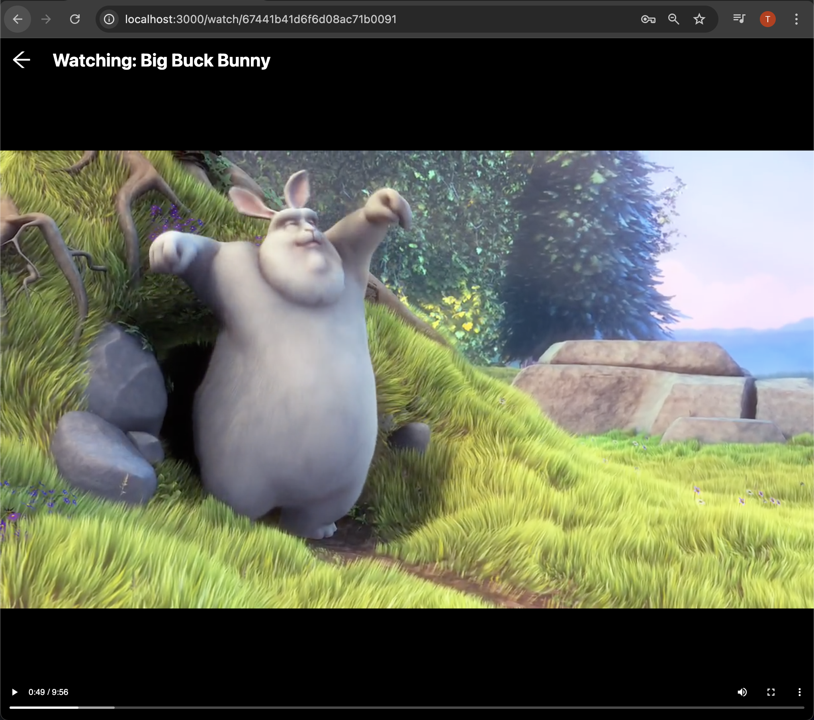

### Live Demo

https://td-netflixapp.vercel.app/


# Setup

- Install [Node](https://nodejs.org/en/download/)
- Install [Git](https://git-scm.com/book/en/v2/Getting-Started-Installing-Git)
- Clone the repository `https://github.com/tddag/messenger-clone-app`
- Install dependencies `npm install`
- Set up MongoDB
- Setup environment variables:
  - <table>
        <tr>
            <th>Variable</th>
            <th>Value</th>
            <th>Description</th>
        </tr>
        <tr>
            <td>DATABASE_URL</td>
            <td>mongodb+srv:/....</td>
            <td>MongoDB URL</td>
        </tr>
        <tr>
            <td>NEXTAUTH_JWT_SECRET</td>
            <td>.....</td>
            <td>JWT Authentication Secret Key</td>
        </tr>
        <tr>
            <td>NEXTAUTH_SECRET</td>
            <td>.....</td>
            <td>Authentication Secret Key</td>
        </tr>
        <tr>
            <td>GITHUB_ID</td>
            <td>b3510....</td>
            <td>Github Authentication ID</td>
        </tr>
        <tr>
            <td>GITHUB_SECRET</td>
            <td>f214b2e4....</td>
            <td>Github Authentication Secret</td>
        </tr>
        <tr>
            <td>GOOGLE_CLIENT_ID</td>
            <td>23701....</td>
            <td>Google Authentication ID</td>
        </tr>
        <tr>
            <td>GOOGLE_CLIENT_SECRET</td>
            <td>GOCSP....</td>
            <td>Google Authentication Secret</td>
        </tr>                                                   
    </table>
- Run the application `npm run dev`

# Functionalities

- User Authentication
  - <table>
        <tr>
            <td></td>
            <td></td>
            <td></td>
        </tr>
    </table>
- Movie Listing, Random Billboard
  - <table>
        <tr>
            <td></td>
        </tr>
    </table>
- Add to My List, Movie Info, Play Movie
  - <table>
        <tr>
            <td></td>
            <td></td>
            <td></td>
        </tr>
    </table>

# Technologies/Libraries

- NextJS: Web Framework
- Prisma: Node.js and TypeScript ORM (Object-Relational Mapping)
- MongoDB: database
- TailwindCSS: CSS Framework
- Axios: promised based HTTP client
- Bcrypt: hashing password
- Lodash: utility library
- Zustand: State Mangement library
- Typescript: static typing
- React: Web library
- SWR: React Hooks for Data Fetching

## Getting Started

This is a [Next.js](https://nextjs.org/) project bootstrapped with [`create-next-app`](https://github.com/vercel/next.js/tree/canary/packages/create-next-app).

First, run the development server:

```bash
npm run dev
# or
yarn dev
```

Open [http://localhost:3000](http://localhost:3000) with your browser to see the result.

You can start editing the page by modifying `pages/index.tsx`. The page auto-updates as you edit the file.

[API routes](https://nextjs.org/docs/api-routes/introduction) can be accessed on [http://localhost:3000/api/hello](http://localhost:3000/api/hello). This endpoint can be edited in `pages/api/hello.ts`.

The `pages/api` directory is mapped to `/api/*`. Files in this directory are treated as [API routes](https://nextjs.org/docs/api-routes/introduction) instead of React pages.

## Learn More

To learn more about Next.js, take a look at the following resources:

- [Next.js Documentation](https://nextjs.org/docs) - learn about Next.js features and API.
- [Learn Next.js](https://nextjs.org/learn) - an interactive Next.js tutorial.

You can check out [the Next.js GitHub repository](https://github.com/vercel/next.js/) - your feedback and contributions are welcome!

## Deploy on Vercel

The easiest way to deploy your Next.js app is to use the [Vercel Platform](https://vercel.com/new?utm_medium=default-template&filter=next.js&utm_source=create-next-app&utm_campaign=create-next-app-readme) from the creators of Next.js.

Check out our [Next.js deployment documentation](https://nextjs.org/docs/deployment) for more details.
